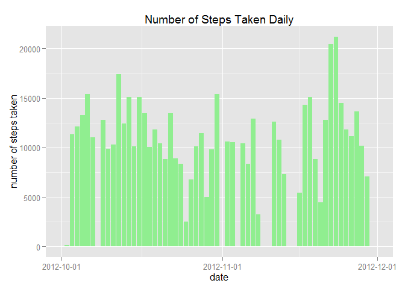
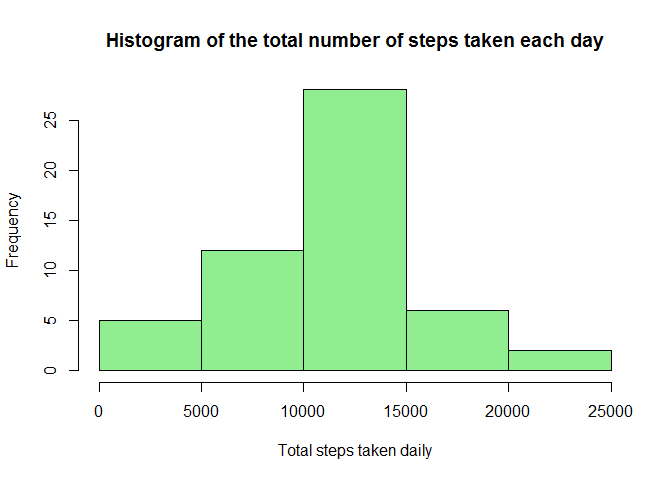
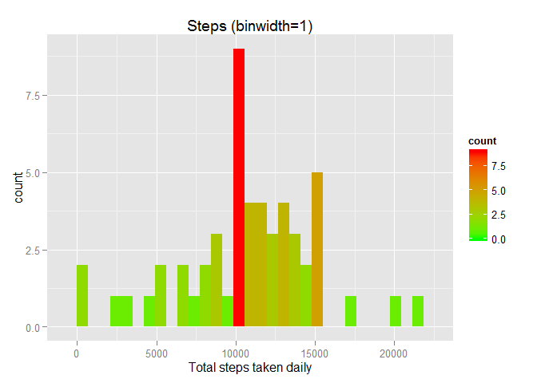
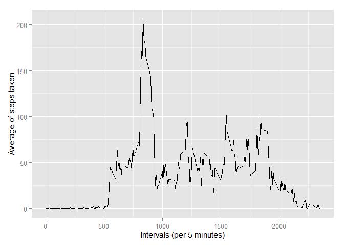
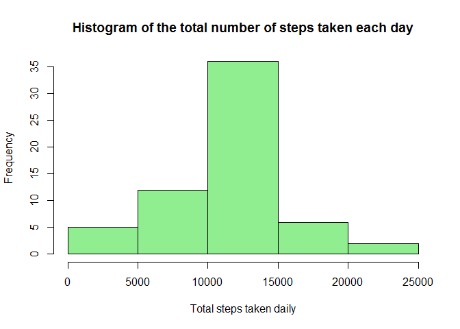
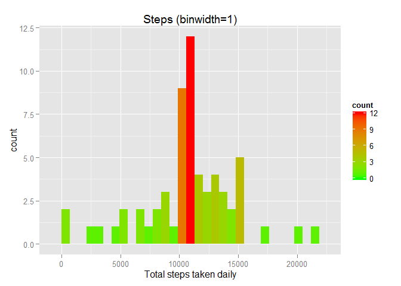
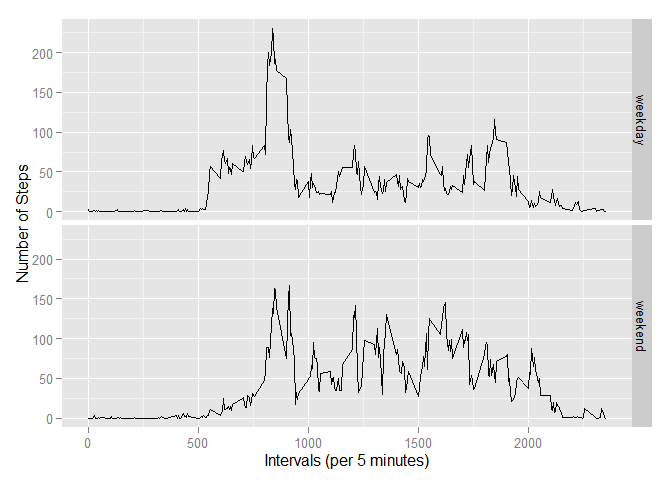

# Reproducible Research: Peer Assessment 1

#### Cornelius Mellino
#### July 19, 2015

## Loading and preprocessing the data
We need the ggplot2 library

```r
library(ggplot2)
```

```
## Warning: package 'ggplot2' was built under R version 3.1.3
```

#### 1. Load the data
Then load the activity data from CSV file

```r
raw.activity.data <- read.csv("activity.csv")
head(raw.activity.data)
```

```
##   steps       date interval
## 1    NA 2012-10-01        0
## 2    NA 2012-10-01        5
## 3    NA 2012-10-01       10
## 4    NA 2012-10-01       15
## 5    NA 2012-10-01       20
## 6    NA 2012-10-01       25
```

```r
tail(raw.activity.data)
```

```
##       steps       date interval
## 17563    NA 2012-11-30     2330
## 17564    NA 2012-11-30     2335
## 17565    NA 2012-11-30     2340
## 17566    NA 2012-11-30     2345
## 17567    NA 2012-11-30     2350
## 17568    NA 2012-11-30     2355
```

#### 2. Process/transform the data (if necessary) into a format suitable for your analysis
Preprocess the data by removing the NA values. 

```r
clean.activity.data <- na.omit(raw.activity.data)
head(clean.activity.data)
```

```
##     steps       date interval
## 289     0 2012-10-02        0
## 290     0 2012-10-02        5
## 291     0 2012-10-02       10
## 292     0 2012-10-02       15
## 293     0 2012-10-02       20
## 294     0 2012-10-02       25
```

```r
tail(clean.activity.data)
```

```
##       steps       date interval
## 17275     0 2012-11-29     2330
## 17276     0 2012-11-29     2335
## 17277     0 2012-11-29     2340
## 17278     0 2012-11-29     2345
## 17279     0 2012-11-29     2350
## 17280     0 2012-11-29     2355
```

## What is mean total number of steps taken per day?
#### 1. Calculate the total number of steps taken per day
After we have a clean data, do an aggregation on steps by date. Plot it to have an overview of the steps vs date data.

```r
aggregated.activity.data <- aggregate(steps ~ date, clean.activity.data, sum)

ggplot(aggregated.activity.data, aes(x = as.Date(date), y = steps)) + geom_bar(stat = "identity", position="dodge", fill="lightgreen") + scale_x_date(breaks = "1 month", limits = as.Date(c('2012-10-01','2012-12-01'))) + xlab("date") + ylab("number of steps taken") + ggtitle("Number of Steps Taken Daily")
```

 

#### 2. Make a histogram of the total number of steps taken each day

```r
hist(aggregated.activity.data$steps, col="lightgreen", main="Histogram of the total number of steps taken each day", xlab="Total steps taken daily")
```

 

After we have the histogram, let's try to set the binwidth to 1 and the histogram is showing different shape.

```r
qplot(steps, data=aggregated.activity.data, binwidth = "1", xlab = "Total steps taken daily", 
      main = "Steps (binwidth=1)", na.rm=TRUE) + 
      geom_histogram(aes(fill = ..count..)) + scale_fill_gradient("count", low = "green", high = "red")
```

 

#### 3. Calculate and report the mean and median of the total number of steps taken per day
The mean of the total number of steps taken per day:

```r
mean(aggregated.activity.data$steps)
```

```
## [1] 10766.19
```

The median of the total number of steps taken per day:

```r
median(aggregated.activity.data$steps)
```

```
## [1] 10765
```

Compare with the result calculated by summary() function:

```r
summary(aggregated.activity.data)
```

```
##          date        steps      
##  2012-10-02: 1   Min.   :   41  
##  2012-10-03: 1   1st Qu.: 8841  
##  2012-10-04: 1   Median :10765  
##  2012-10-05: 1   Mean   :10766  
##  2012-10-06: 1   3rd Qu.:13294  
##  2012-10-07: 1   Max.   :21194  
##  (Other)   :47
```


## What is the average daily activity pattern?
#### 1. Make a time series plot of the 5-minute interval (x-axis) and the average number of steps taken, averaged across all days (y-axis)
Before we plot the graph, we should do an aggregation on steps and interval using mean() function.

```r
avg.activity.data <- aggregate(x=list(steps=clean.activity.data$steps), by=list(interval=clean.activity.data$interval), FUN=mean)

ggplot(data=avg.activity.data, aes(x=interval, y=steps)) + geom_line() + 
  xlab("Intervals (per 5 minutes)") + ylab("Average of steps taken")
```

 

#### 2. Which 5-minute interval, on average across all the days in the dataset, contains the maximum number of steps?
Now the 5-minute interval which have the maximum number of steps is:

```r
avg.activity.data[which.max(avg.activity.data$steps),]
```

```
##     interval    steps
## 104      835 206.1698
```


## Imputing missing values
#### 1. Calculate and report the total number of missing values in the dataset (i.e. the total number of rows with NAs)
The total number of missing values in the dataset is:

```r
missing.values <- is.na(raw.activity.data$steps)
sum(missing.values)
```

```
## [1] 2304
```

#### 2. Devise a strategy for filling in all of the missing values in the dataset. The strategy does not need to be sophisticated. For example, you could use the mean/median for that day, or the mean for that 5-minute interval, etc.
For filling the NA in the dataset, we can take this strategy:

a. Copy the raw data.

```r
filled.activity.data <- raw.activity.data
```

b. Create a function that scan accross the raw data, if it found an NA then replace it with the mean of steps taken each day for that interval, if it found a value then return the steps value.

```r
fillNA <- function(steps, interval){
  value <- NA
  if (!is.na(steps))
    return(steps)
  else
    value <- (avg.activity.data[avg.activity.data$interval==interval, "steps"])
  return(value)
}
```

c. Run the function on the copied raw data to be filled.

```r
filled.activity.data$steps <- mapply(fillNA, filled.activity.data$steps, filled.activity.data$interval)
```

d. Compare the head, tail and the missing values.

```r
head(raw.activity.data)
```

```
##   steps       date interval
## 1    NA 2012-10-01        0
## 2    NA 2012-10-01        5
## 3    NA 2012-10-01       10
## 4    NA 2012-10-01       15
## 5    NA 2012-10-01       20
## 6    NA 2012-10-01       25
```

```r
head(filled.activity.data)
```

```
##       steps       date interval
## 1 1.7169811 2012-10-01        0
## 2 0.3396226 2012-10-01        5
## 3 0.1320755 2012-10-01       10
## 4 0.1509434 2012-10-01       15
## 5 0.0754717 2012-10-01       20
## 6 2.0943396 2012-10-01       25
```

```r
tail(raw.activity.data)
```

```
##       steps       date interval
## 17563    NA 2012-11-30     2330
## 17564    NA 2012-11-30     2335
## 17565    NA 2012-11-30     2340
## 17566    NA 2012-11-30     2345
## 17567    NA 2012-11-30     2350
## 17568    NA 2012-11-30     2355
```

```r
tail(filled.activity.data)
```

```
##           steps       date interval
## 17563 2.6037736 2012-11-30     2330
## 17564 4.6981132 2012-11-30     2335
## 17565 3.3018868 2012-11-30     2340
## 17566 0.6415094 2012-11-30     2345
## 17567 0.2264151 2012-11-30     2350
## 17568 1.0754717 2012-11-30     2355
```

total number of missing values before being filled:

```r
sum(missing.values)
```

```
## [1] 2304
```

total number of missing values after being filled:

```r
new.missing.values <- is.na(filled.activity.data$steps)
sum(new.missing.values)
```

```
## [1] 0
```

#### 3. Create a new dataset that is equal to the original dataset but with the missing data filled in.
The new dataset already created above (filled.activity.data)

```r
head(filled.activity.data)
```

```
##       steps       date interval
## 1 1.7169811 2012-10-01        0
## 2 0.3396226 2012-10-01        5
## 3 0.1320755 2012-10-01       10
## 4 0.1509434 2012-10-01       15
## 5 0.0754717 2012-10-01       20
## 6 2.0943396 2012-10-01       25
```

```r
tail(filled.activity.data)
```

```
##           steps       date interval
## 17563 2.6037736 2012-11-30     2330
## 17564 4.6981132 2012-11-30     2335
## 17565 3.3018868 2012-11-30     2340
## 17566 0.6415094 2012-11-30     2345
## 17567 0.2264151 2012-11-30     2350
## 17568 1.0754717 2012-11-30     2355
```

#### 4. Make a histogram of the total number of steps taken each day and Calculate and report the mean and median total number of steps taken per day. Do these values differ from the estimates from the first part of the assignment? What is the impact of imputing missing data on the estimates of the total daily number of steps?
Now we can create the aggregated data from the newly filled dataset.

```r
aggregated.filled.activity.data <- aggregate(steps ~ date, filled.activity.data, sum)
head(aggregated.filled.activity.data)
```

```
##         date    steps
## 1 2012-10-01 10766.19
## 2 2012-10-02   126.00
## 3 2012-10-03 11352.00
## 4 2012-10-04 12116.00
## 5 2012-10-05 13294.00
## 6 2012-10-06 15420.00
```

Create the histogram of the aggregated data.

```r
hist(aggregated.filled.activity.data$steps, col="lightgreen", main="Histogram of the total number of steps taken each day", xlab="Total steps taken daily")
```

 

Create the histogram of the aggregated data with binwidth = 1.

```r
qplot(steps, data=aggregated.filled.activity.data, binwidth = "1", xlab = "Total steps taken daily", 
      main = "Steps (binwidth=1)", na.rm=TRUE) + 
      geom_histogram(aes(fill = ..count..)) + scale_fill_gradient("count", low = "green", high = "red")
```

 

The mean of the total number of steps taken per day:

```r
mean(aggregated.filled.activity.data$steps)
```

```
## [1] 10766.19
```

The median of the total number of steps taken per day:

```r
median(aggregated.filled.activity.data$steps)
```

```
## [1] 10766.19
```

Compare with the result calculated by summary() function:

```r
summary(aggregated.filled.activity.data)
```

```
##          date        steps      
##  2012-10-01: 1   Min.   :   41  
##  2012-10-02: 1   1st Qu.: 9819  
##  2012-10-03: 1   Median :10766  
##  2012-10-04: 1   Mean   :10766  
##  2012-10-05: 1   3rd Qu.:12811  
##  2012-10-06: 1   Max.   :21194  
##  (Other)   :55
```

If we compare the mean and median before and after filled, we will find that the mean is not changing, while the median shifted to the greater value.

## Are there differences in activity patterns between weekdays and weekends?
#### 1. Create a new factor variable in the dataset with two levels - "weekday" and "weekend" indicating whether a given date is a weekday or weekend day.
To create a new factor variable that contains "weekday" and "weekend" indicators, first, we should use the chron library, or lubridate.

```r
library(chron)
```

```
## Warning: package 'chron' was built under R version 3.1.3
```

Copy the filled dataset to the new dataset (test.activity.data).

```r
test.activity.data <- filled.activity.data
```

Insert the new variable, weektime.

```r
test.activity.data$weektime <- as.factor(ifelse(is.weekend(raw.activity.data$date),"weekend", "weekday"))
head(test.activity.data)
```

```
##       steps       date interval weektime
## 1 1.7169811 2012-10-01        0  weekday
## 2 0.3396226 2012-10-01        5  weekday
## 3 0.1320755 2012-10-01       10  weekday
## 4 0.1509434 2012-10-01       15  weekday
## 5 0.0754717 2012-10-01       20  weekday
## 6 2.0943396 2012-10-01       25  weekday
```


#### 2. Make a panel plot containing a time series plot (i.e. type = "l") of the 5-minute interval (x-axis) and the average number of steps taken, averaged across all weekday days or weekend days (y-axis). See the README file in the GitHub repository to see an example of what this plot should look like using simulated data.
Plot the averaged data.

```r
avg.test.activity.data <- aggregate(steps ~ interval + weektime, data=test.activity.data, mean)
ggplot(avg.test.activity.data, aes(interval, steps))+geom_line()+ facet_grid(weektime ~ .) + xlab("Intervals (per 5 minutes)") + ylab("Number of Steps")
```

 

From the plot above, we can draw conclusion that subjects tend to move frequently on weekend. The differences are contrastly seen at the middle of the interval range, while at the beginning and the end of the range the activity almost the same.
